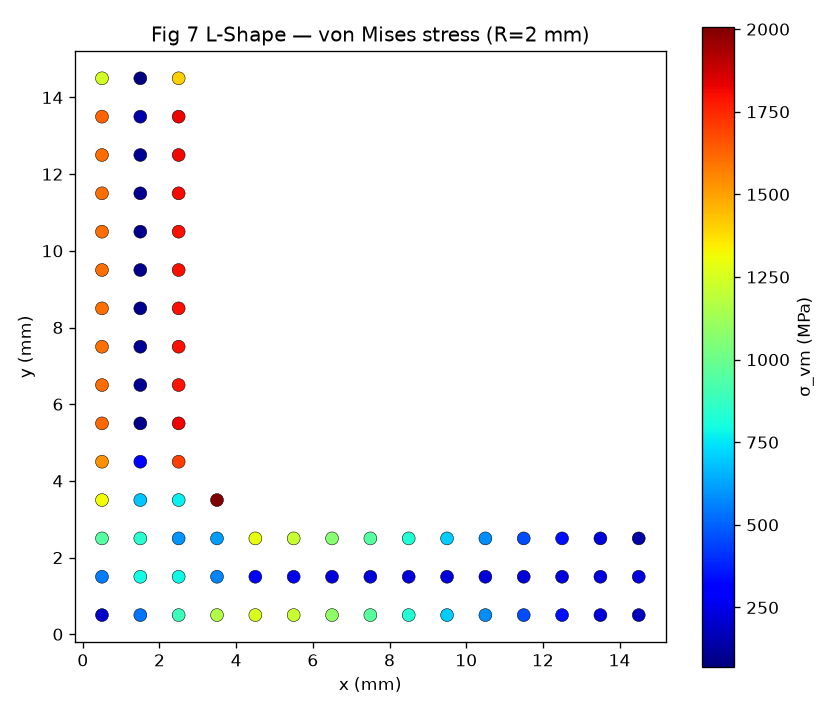
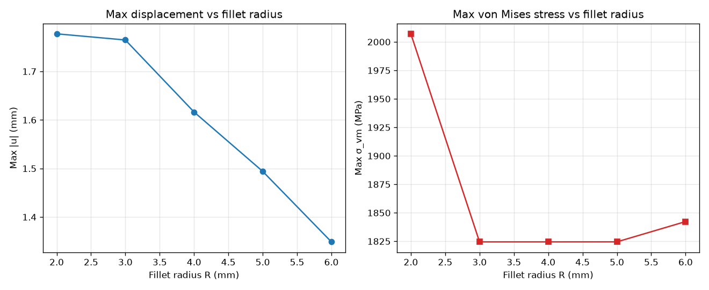
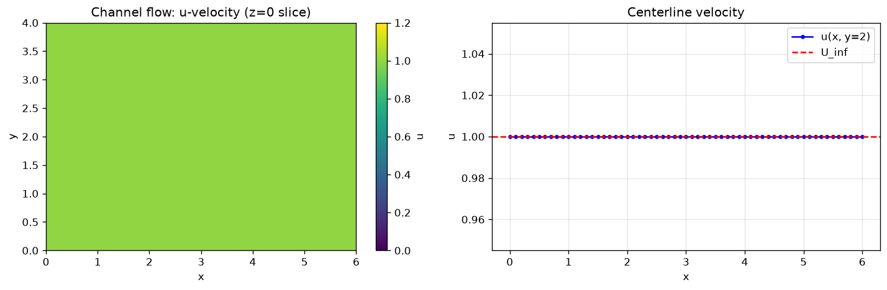
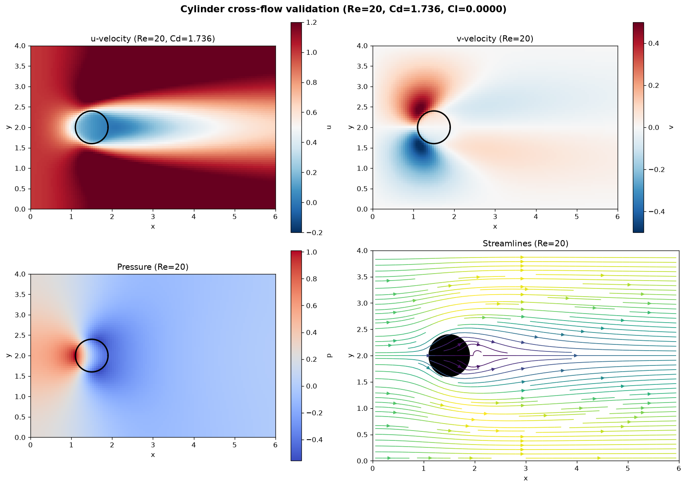
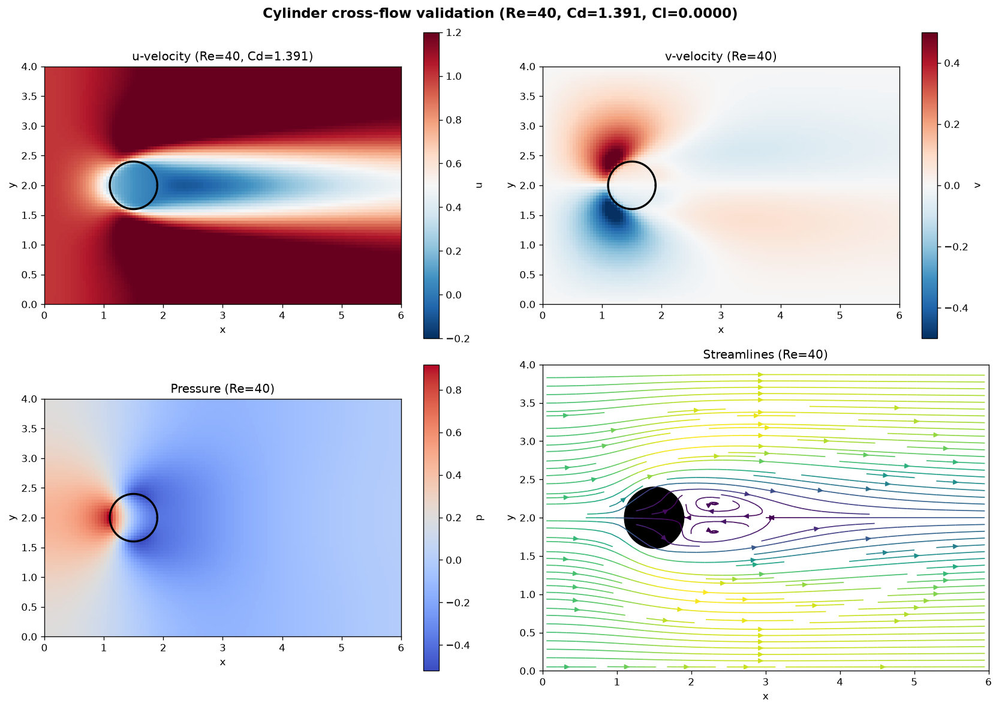

# XVoxel-FCM

[](https://www.python.org/)
[](LICENSE)
[]()

Reproduction of the JCAD 2024 paper:

> **"XVoxel-Based Parametric Design Optimization of Feature Models"**
> — *Li et al., Journal of Computational and Applied Design, 2024*

XVoxel-FCM implements the **XVoxel extended voxel data structure** and the
**Finite Cell Method (FCM)** for efficient, re-meshing-free parametric
design optimization of feature-based CAD models. It also includes a
**Finite Volume Method (FVM) + Immersed Boundary Method (IBM)** fluid
solver that reuses the same XVoxel geometry layer.

---

## Features

| Module | Description |
|--------|-------------|
| **XVoxel Data Structure** | Extended voxel grid with CSG tree for full feature history tracking |
| **Point Membership Classification (PMC)** | Fast, history-aware material classification respecting feature edit order |
| **Finite Cell Method (FCM)** | High-order embedded-domain FEM on fixed Cartesian grids — no re-meshing |
| **Parametric Feature Editing** | Edit feature parameters (dimensions, positions, radii) with incremental stiffness updates |
| **FVM + IBM Fluid Solver** | Staggered-grid (MAC) finite volume + immersed boundary + SIMPLE algorithm for incompressible flow |

---

## Architecture

The project is organized into three independent layers, each a pure-Python
package consuming the layer below:

```
┌─────────────────────────────────────────────────────┐
│  examples/   — canonical runnable examples          │
├─────────────────────────────────────────────────────┤
│  fcm/        — Finite Cell Method solver            │
│  fluid/      — FVM + IBM fluid solver               │
├─────────────────────────────────────────────────────┤
│  xvoxel/     — XVoxel geometry + CSG + PMC          │
├─────────────────────────────────────────────────────┤
│  numpy / scipy / matplotlib                         │
└─────────────────────────────────────────────────────┘
```

- **`xvoxel/`** — Geometry layer (pure numpy, no scipy). Translates a user
  feature/CSG description into per-voxel material classification.
  Public API: `XVoxelModel`, `Feature`, `Boolean`, `BoolOp`,
  `classify_sdfs`, `Cube`, `CylinderZ`, `CylinderY`, `Sphere`,
  `RoundCorner2D`.
- **`fcm/`** — Finite Cell Method solver (depends on `xvoxel/` + numpy/scipy).
  Public API: `FCMSolver`, `UniformHexMesh`, `assemble_fcm_k`, hex8/20/32
  elements, Gauss rules, `elastic_matrix_D`.
- **`fluid/`** — FVM + IBM fluid solver (depends on `xvoxel/`, parallel to
  `fcm/`). Public API: `FluidSolver`, `StaggeredGrid`, `IBMForce`,
  `FluidBC`, `MomentumSolver`, `PressureSolver`, `SIMPLESolver`.

---

## Installation

```bash
# Clone the repository
git clone https://github.com/WenyuSun/XVoxel-FCM.git
cd XVoxel-FCM

# Create and activate a virtual environment
python -m venv .venv
# Windows:
.venv\Scripts\activate
# Linux / macOS:
source .venv/bin/activate

# Install dependencies
pip install -r requirements.txt
```

---

## Quick Start

Two canonical examples are provided. Each can be run directly or via the
Makefile.

### Example 1 — L-Shape Bracket (FCM, Paper Fig 7–9)

```bash
python examples/fig7_lshape_v2.py
# or
make fig7
```

Simulates an L-shaped bracket ($15 \times 15 \times 3$ mm) under a downward
traction load, with a 5-step fillet radius editing sequence
($R: 6 \rightarrow 5 \rightarrow 4 \rightarrow 3 \rightarrow 2$ mm). The
example prints a results summary and saves two figures to `figures/`:

| R (mm) | Max \|u\| (mm) | Max σ_vm (MPa) |
|:------:|:--------------:|:--------------:|
| 6.0 | 1.348797 | 1842.31 |
| 5.0 | 1.494054 | 1824.50 |
| 4.0 | 1.616371 | 1824.48 |
| 3.0 | 1.764721 | 1824.47 |
| 2.0 | 1.777411 | 2007.09 |

<p align="center">
  
  
</p>

### Example 2 — Cylinder Cross-Flow (Fluid, FVM + IBM)

```bash
python examples/cylinder_flow_validation.py
# or
make fluid
```

Validates the fluid solver at two levels:

- **Level 0** — Pure channel Poiseuille flow (no obstacle): mass
  conservation and divergence convergence.
- **Level 1** — Cylinder cross-flow at Re = 20 and Re = 40: drag
  coefficient (Cd) magnitude and lift (Cl) symmetry, compared against
  classical experimental data (Tritton 1959).

| Item | Result | Reference | Verdict |
|------|--------|-----------|---------|
| Level 0 divergence | 0.0000 | < 0.5 | PASS |
| Level 0 mass conservation | 1.0000 | ~ 1.0 | PASS |
| Level 1 Cd (Re=40) | 1.391 | [1.43, 1.6] | PASS |
| Level 1 Cl (Re=40) | 0.0000 | \|Cl\| < 0.5 | PASS |
| Level 1 Cd (Re=20) | 1.736 | [1.7, 2.1] | PASS |
| Level 1 Cl (Re=20) | 0.0000 | \|Cl\| < 0.5 | PASS |

<p align="center">
  
  
  
</p>

---

## Project Structure

```
xvoxel/          # Geometry layer: XVoxel model, CSG, primitives, PMC
├── xvoxel.py    #   XVoxelModel — extended voxel data structure
├── csg.py       #   Feature, Boolean, BoolOp, classify_sdfs
└── primitives.py#   Cube, CylinderZ/Y, Sphere, RoundCorner2D
fcm/             # Finite Cell Method solver
├── elements.py  #   Hex8/20/32 shape fns, Gauss rules, elastic D matrix
├── mesh.py      #   UniformHexMesh → Hex8/20/32
├── assembly.py  #   Global stiffness assembly, octree boundary integration
├── boundary.py  #   Dirichlet BC, face traction
└── solver.py    #   FCMSolver — unified facade
fluid/           # FVM + IBM fluid solver
├── staggered_grid.py  # MAC staggered grid
├── ibm.py / sharp_ibm.py  # Immersed boundary force
├── momentum.py / pressure.py  # Momentum & pressure Poisson
├── simple_solver.py    # SIMPLE main loop
└── solver.py    #   FluidSolver — unified facade
examples/        # Canonical runnable examples (git-tracked)
├── fig7_lshape_v2.py          # FCM L-shape (Paper Fig 7-9)
└── cylinder_flow_validation.py# Fluid cylinder cross-flow validation
tests/           # Unit + integration tests
├── test_regression_fig7.py    # P1 numerical fidelity gate (golden baseline)
├── test_vectorization_bit_level.py
├── test_xvoxel_v2.py
├── test_fcm_v2.py
├── test_fluid.py
└── baselines/   # Golden baseline + generator
figures/         # Generated result figures (canonical examples tracked)
```

> **Note:** `doc/` and `output/` are local-only (gitignored) — design docs
> and scratch outputs are not tracked in the repository.

---

## Dependencies

- Python ≥ 3.9
- [NumPy](https://numpy.org/) ≥ 1.22
- [SciPy](https://scipy.org/) ≥ 1.8
- [Matplotlib](https://matplotlib.org/) ≥ 3.5
- [pytest](https://pytest.org/) ≥ 7.0

---

## Testing

```bash
# Full suite (excludes slow integration tests)
make test-quick
# or
pytest tests/ -v -m "not slow"

# Numerical fidelity gate (regression vs golden baseline)
make test-fidelity

# Full suite including slow tests
make test
```

---

## Build Targets

| Target | Description |
|--------|-------------|
| `make fig7` | Run FCM L-shape canonical example |
| `make fluid` | Run fluid cylinder cross-flow validation |
| `make baseline` | Regenerate golden baseline (**intentional algorithm changes only**) |
| `make test` | Run full test suite |
| `make test-fidelity` | Run regression + bit-level fidelity tests |
| `make test-quick` | Run fast unit tests (exclude slow integration) |
| `make clean` | Remove generated figures |

> **Note:** On Windows, run Make targets via `mingw32-make` or use the
> equivalent `python` commands shown above.

---

## Citation

If you use this code in your research, please cite the original paper:

```bibtex
@article{li2024xvoxel,
  title   = {XVoxel-Based Parametric Design Optimization of Feature Models},
  author  = {Li, ...},
  journal = {Journal of Computational and Applied Design},
  year    = {2024}
}
```

---

## License

MIT License — see [LICENSE](LICENSE) for details.
